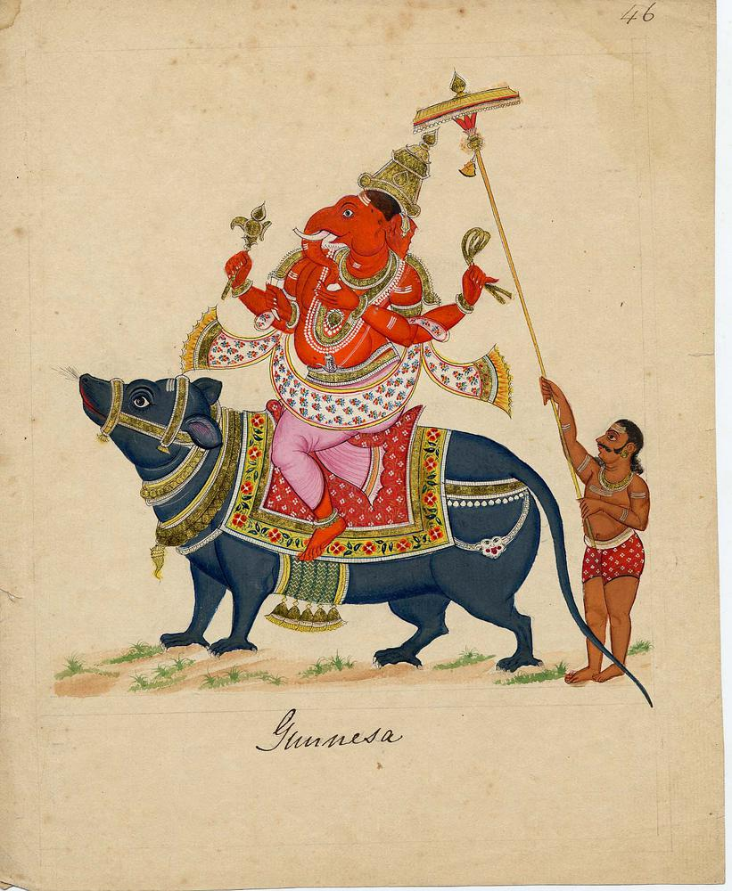

## श्रीगणेशाय नमः, _śrīgaṇeśāya namaḥ_: “salutations to the revered gaṇeśa“[^1]

 
[Representation of: Gaṇeśa](https://www.britishmuseum.org/collection/object/A_2007-3005-46)[^2] via The Trustees of the British Museum (CC BY-NC-SA 4.0)

[^1]: गण, _ganá_: “a flock, troop, multitude, number, tribe, series, class (of animate or inanimate beings), body of followers or attendants ([Monier-Williams 343](https://www.sanskrit-lexicon.uni-koeln.de/scans/csl-apidev/servepdf.php?dict=MW&page=343))” +‎ ईश, _īśá_: “a ruler, master, lord ([Monier-Williams 171](https://www.sanskrit-lexicon.uni-koeln.de/scans/csl-apidev/servepdf.php?dict=MW&page=171))”
[^2]: _Brahmañaspati_ is explained by Sáyaña, _brahmaño annasya parivridhasya karmano vá pálayatri_, the protector or cherisher of food, or of any great or solemn acts of devotion: he has other attributes in the text, as, _ganánám ganapatih_, chief of the ganas, which generally denotes the classes of the inferior divinities, as the commentator here understands it; and again, _jyeshtharájam brahmanám_, the best lord of _mantras_, or prayers,— _prasasyam swiminam mantránám_ ([Wilson 262](https://archive.org/details/rigvedasanhitc02wils/page/262/mode/2up)).
